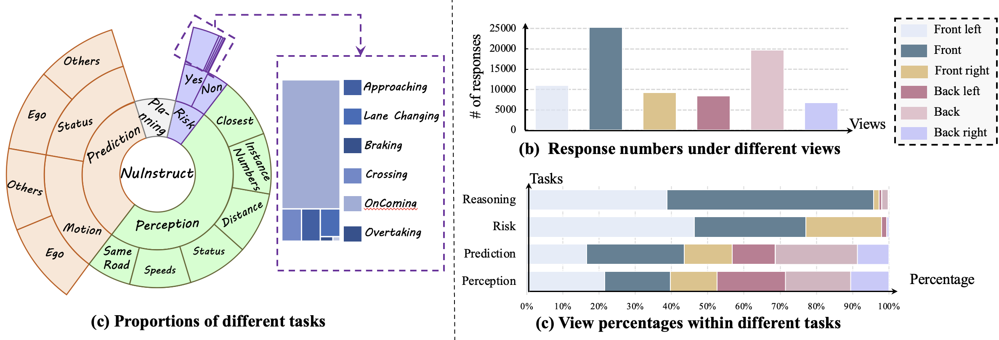

# [CVPR2024]Holistic Autonomous Driving Understanding by Bird’s-Eye-View Injected Multi-Modal Large Models
### [[Paper]](https://arxiv.org/pdf/2401.00988.pdf) 

> [**Holistic Autonomous Driving Understanding by Bird’s-Eye-View Injected Multi-Modal Large Models**](https://arxiv.org/pdf/2401.00988.pdf),          
> Xinpeng Ding, Jianhua Han, Hang Xu, Xiaodan Liang, Wei Zhang and Xiaomeng Li
> **Arxiv preprint**

## Introduction

We introduce a new Dataset (NuInstruct), a novel dataset with 91K multi-view video-QA pairs across 17 subtasks, where
each task demands holistic information ( e.g., temporal, multi-view, and spatial), significantly elevating the challenge level.

## Annotation Schema

In our research, we propose an SQL-based approach for the automated generation of four types of instruction-follow data, namely: Perception, Prediction, Risk, and Planning with Reasoning. This methodology aligns with the sequential decision-making stages of human drivers, categorized as follows: 1. Perception: The initial stage of recognizing surrounding entities. 2. Prediction: Forecasting the future actions of these entities. 3. Risk: Identifying imminent dangers, such as vehicles executing overtaking manoeuvres. 4. Planning with Reasoning: Developing a safe travel plan
grounded in logical analysis.

## Dataset Statistics

Statistics of NuInstruct. (a) Proportions of different tasks. The size of the arc represents the proportions of each task, while the same color indicates tasks of the same category. Our task encompasses a diverse range of tasks including perception, prediction, risk, and planning. (b) Response numbers under different views. The horizontal axis represents different views,and the vertical axis indicates the number of responses requiring information from the corresponding view. (c) View percentages within different tasks. The horizontal and vertical axes represent the proportion of different views and task classes, respectively

## Annotation Details
The format of the annotation file is shown as follows:
```none
Train
{
  'task': ...,  # the task type, e.g., risk-overtaking
  'qa_id':...,   # QA pairs ID
  'img_path':..., # image path list for a video clip
  'Question':...., # 
  'Answer':...,
  'sample_list':.... # sample token list of corresponding images in NuScense
}
```
You can download the images from [nuScenes](https://www.nuscenes.org/)

You can also download the annotations from [Google Driver](https://drive.google.com/file/d/1ybwvgnPFRVwmEAJudWwnGQ8wLitzQ82O/view?usp=sharing)
## BibTeX
If you find our work useful in your research, please consider citing our paper:
```
@article{ding2024holistic,
  title={Holistic Autonomous Driving Understanding by Bird's-Eye-View Injected Multi-Modal Large Models},
  author={Xinpeng, Ding and Jinahua, Han and Hang, Xu and Xiaodan, Laing and Xu, Hang and Wei, Zhang and Xiaomeng, Li},
  booktitle={CVPR24},
  year={2024}
}
```

## Acknowledgements
We thanks for the opensource projects.
- [nuScenes](https://github.com/nutonomy/nuscenes-devkit)
- [LAVIS](https://github.com/salesforce/LAVIS)
- [MiniGPT-4](https://github.com/Vision-CAIR/MiniGPT-4)
