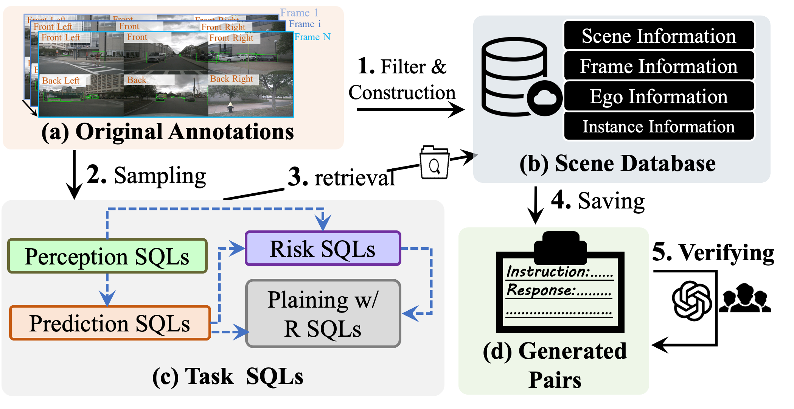

# Holistic Autonomous Driving Understanding by Bird’s-Eye-View Injected Multi-Modal Large Models
### [[Paper]](https://arxiv.org/pdf/2401.00988.pdf) 

> [**Holistic Autonomous Driving Understanding by Bird’s-Eye-View Injected Multi-Modal Large Models**](https://arxiv.org/pdf/2401.00988.pdf),          
> Xinpeng Ding, Jianhua Han, Hang Xu, Xiaodan Liang, Wei Zhang and Xiaomeng Li
> **Arxiv preprint**

## Introduction

We introduce a new Dataset (NuInstruct), a novel dataset with 91K multi-view video-QA pairs across 17 subtasks, where
each task demands holistic information ( e.g., temporal, multi-view, and spatial), significantly elevating the challenge level.

## Annotation Schema

In our research, we propose an SQL-based approach for the automated generation of four types of instruction-follow data, namely: Perception, Prediction, Risk, and Planning with Reasoning. This methodology aligns with the sequential decision-making stages of human drivers, categorized as follows: 1. Perception: The initial stage of recognizing surrounding entities. 2. Prediction: Forecasting the future actions of these entities. 3. Risk: Identifying imminent dangers, such as vehicles executing overtaking manoeuvres. 4. Planning with Reasoning: Developing a safe travel plan
grounded in logical analysis.

## Dataset Stats

Reason2Drive dataset stands as the largest dataset to date, surpassing others in terms of both dataset size and the inclusion of extensive long-text chain-based reasoning references.

We split the dataset according to the task (perception, prediction and reasoning) and target.
The benchmark exhibits a balanced distribution.

## BibTeX
If you find our work useful in your research, please consider citing our paper:
```
@article{ding2024holistic,
  title={Holistic Autonomous Driving Understanding by Bird's-Eye-View Injected Multi-Modal Large Models},
  author={Xinpeng, Ding and Jinahua, Han and Hang, Xu and Xiaodan, Laing and Xu, Hang and Wei, Zhang and Xiaomeng, Li},
  booktitle={arXiv preprint},
  year={2024}
}
```

## Acknowledgements
We thanks for the opensource projects.
- [nuScenes](https://github.com/nutonomy/nuscenes-devkit)
- [LAVIS](https://github.com/salesforce/LAVIS)
- [MiniGPT-4](https://github.com/Vision-CAIR/MiniGPT-4)